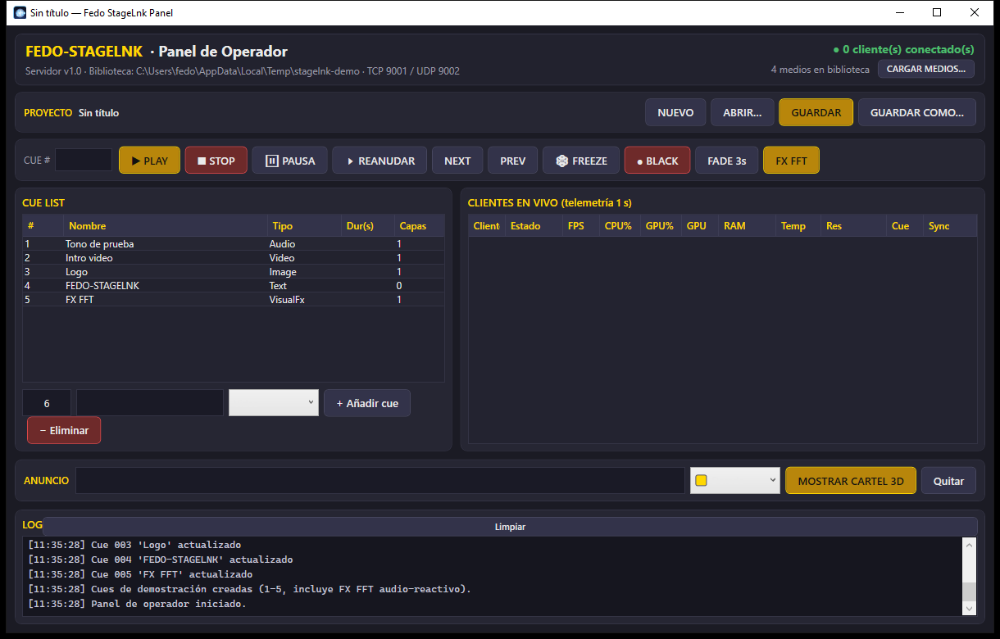

# Hola, soy Federico 👋

🎚️ Técnico de sonido · 🎵 Música y tecnología · 💻 Creative Coding

Trabajo con audio y sonido, y estoy explorando la programación como una herramienta para crear, aprender y construir proyectos.

## Sobre mí

- 🎚️ Sonido, grabación y producción
- 🎛️ Max/MSP y programación de audio
- 🎵 Música algorítmica y creative coding
- 🌐 Desarrollo web
- 🤖 Desarrollo asistido por IA
- 📚 Documentación y aprendizaje técnico

## Proyectos

### fedo-stagelnk

Sistema cliente/servidor para reproducción multimedia distribuida en espectáculos: varios clientes sincronizados a un servidor por LAN Ethernet. .NET 8 + C# + WPF + NAudio + FFmpeg.

Para técnicos de sonido: colas de una línea, cues por número, cartel de bienvenida, muestreo de medios desde una biblioteca local y reproducción distribuida en red.

[Ver proyecto](https://github.com/fedecruz1981/fedo-stagelnk)

### fedo~explorer

Explorador de archivos de audio para escritorio con reproducción integrada, metadata técnica, waveform y medición de BPM y LUFS (EBU R128). Electron + React + Vite.

[Ver proyecto](https://github.com/fedecruz1981/fedo-explorer)

### fedo-downloader

Descarga audio de YouTube y edítalo inline: MP3, WAV o FLAC, con waveform, trim, fades, ganancia y normalización. Electron + React + TypeScript + Python.

[Ver proyecto](https://github.com/fedecruz1981/fedo-downloader)

### fedo-subfactory

Fábrica de Subtítulos: descarga vídeos, los transcribe con Whisper y los traduce a subtítulos en varios idiomas. Electron + React + Python.

[Ver proyecto](https://github.com/fedecruz1981/fedo-subfactory)

### MSP Tutoriales ES

Los 63 tutoriales de MSP de Cycling '74 traducidos al español y organizados como una experiencia web de aprendizaje.

[Ver proyecto](https://github.com/fedecruz1981/msp-tutorials-es)

## Tecnologías

`Max/MSP` `Astro` `MDX` `Electron` `React` `Vite` `TypeScript` `Python` `Tailwind CSS` `yt-dlp` `C#` `.NET 8` `WPF` `NAudio` `FFmpeg` `JavaScript` `Git` `GitHub`

## Actualmente

Explorando nuevas formas de combinar audio, programación, web e inteligencia artificial.

---

[GitHub](https://github.com/fedecruz1981)